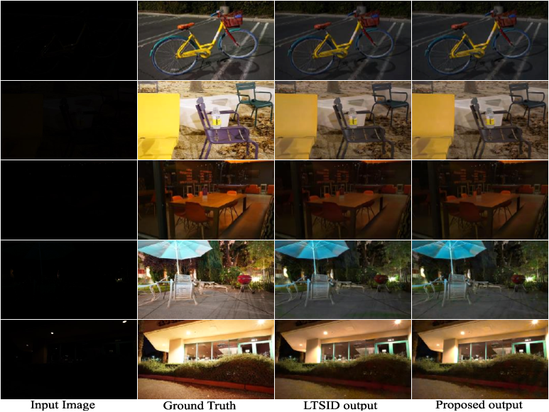

# Faster-to-See-in-the-Dark

It's a faster method for Low-light image processing which is related to the followed paper:

- Title: Decoupling Semantic Context and Color Correlation with multi-class cross branch regularization
- Cite as: [arXiv:1810.07901](https://arxiv.org/abs/1810.07901)

This is only a Tensorflow implementation of the paper.

## Setup

**It uses the same dataset as [Learning-to-See-in-the-Dark](https://github.com/cchen156/Learning-to-See-in-the-Dark), so you can only download the model to start.**

Use the following command to download the dataset or trained model:

```
python utils/download.py
```

Or download directly from Google Drive:

- Improved Model (Multi): [Data](https://drive.google.com/file/d/12yTMuJ6ldziXcIkIec2UmWs0urvDBYqn/view?usp=sharing) and [Meta](https://drive.google.com/file/d/1CRgzPUWFdo3qMhCrTh-GWYZ0D6SDhm74/view?usp=sharing)
- Basic Model (Unet): [Data](https://drive.google.com/file/d/1wmx7AM6XWHjHIvpErmIouQgbQoMxAymG/view?usp=sharing) and [Meta](https://drive.google.com/file/d/1OmrGMng1QuwUa8lf-_wBVvbRJwBr0ETr/view?usp=sharing)
- Dataset: [Sony](https://drive.google.com/file/d/10kpAcvldtcb9G2ze5hTcF1odzu4V_Zvh/view?usp=sharing)


Confirm the data structure is as follows:

```
~/
  dataset/
    Sony/
      long/
        .../
      short/
        .../
  checkpoint/
    Multi/
      model.ckpt.data-00000-of-00001
      model.ckpt.meta
    Unet/
      model.ckpt.data-00000-of-00001
      model.ckpt.meta

```

## Start

Use the following command to train the model:

```
python train.py
```

Use the following commands to test:

```
python test.py
```

Use the following commands to compare the improved method with basic method:

```
python compare.py
```

## Result



Use i5-8500 and GTX-1070 to compare:

| Method | End2End fps |
| ------ | ------ |
| Basic | **1.0578** |
| Improved | **1.1878** |
